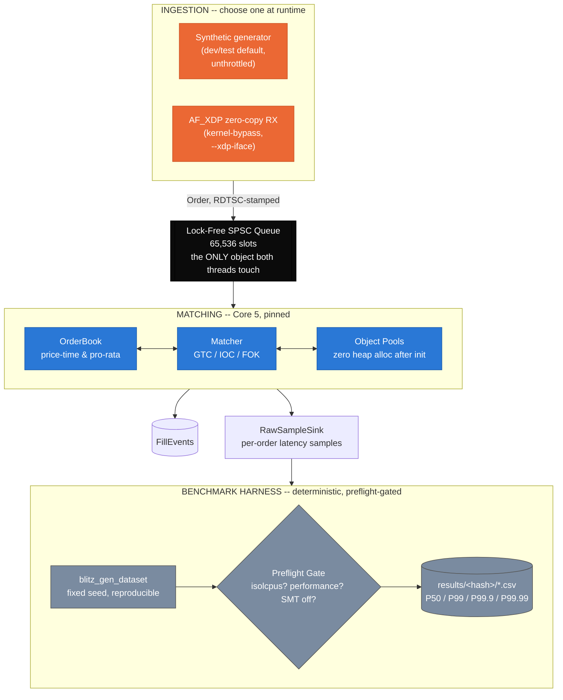
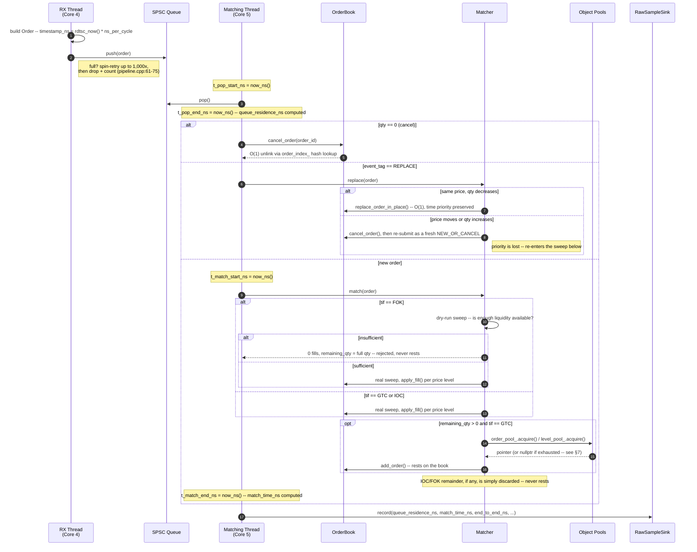
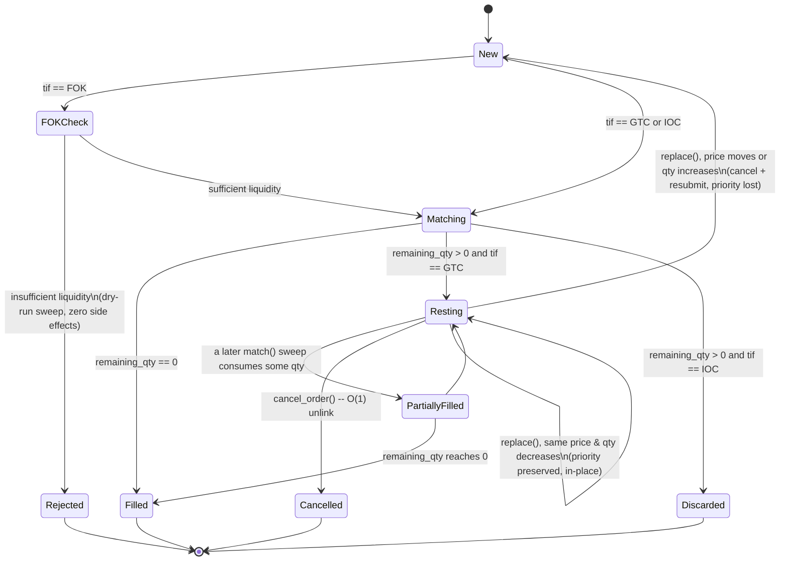
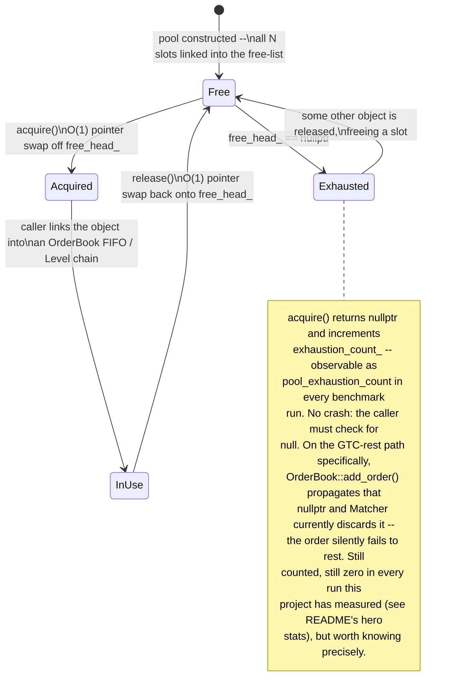

# System Architecture

Seven diagrams, each answering one specific question about how this
codebase actually works — not a restatement of the README's pipeline
diagram, but the layer underneath it: the temporal call sequence, the
concurrency/ownership model, the kernel-bypass packet path, the order
state machine, the zero-allocation memory model, and what happens when
something goes wrong. Every diagram below is grounded in specific
`file:line` references, verified against the current source, not drawn
from memory of what the code "probably" does.

**Scope note:** this document is about *structure* — what exists and how
it's connected. For *why* each design decision was made and the measured
cost of the rejected alternative, see [`docs/DESIGN.md`](docs/DESIGN.md).
For the latency numbers themselves, see [`README.md`](README.md).

---

## Contents

1. [System at a glance](#1-system-at-a-glance)
2. [The life of one order](#2-the-life-of-one-order)
3. [Concurrency & ownership model](#3-concurrency--ownership-model)
4. [AF_XDP packet journey](#4-af_xdp-packet-journey)
5. [Order lifecycle state machine](#5-order-lifecycle-state-machine)
6. [Object pool lifecycle](#6-object-pool-lifecycle)
7. [Failure modes & degradation](#7-failure-modes--degradation)

---

## 1. System at a glance

**What this shows:** every major component in the system, grouped into
the four phases an order actually passes through — ingestion (two
interchangeable sources), the single lock-free handoff, matching (three
tightly-coupled components on one pinned core), and the deterministic
harness that turns all of it into a trustworthy number.

**Why it's drawn this way:** the queue is deliberately the only node with
an arrow crossing *into* and *out of* a core boundary — every other
component belongs entirely to one thread. That's not a simplification for
the diagram; it's the actual concurrency model (see [§3](#3-concurrency--ownership-model)).
The two ingestion sources are drawn as alternatives, not a pipeline stage,
because exactly one runs per process — the benchmark harness never touches
AF_XDP, and AF_XDP mode never touches the dataset replay path.

---

## 2. The life of one order

**What this shows:** the exact, ordered sequence of calls one order (or
cancel, or replace) triggers, from arrival to the latency sample landing
in `RawSampleSink` — the temporal view the component map in §1 doesn't
capture.

**What it proves:** the three `TimeInForce` policies genuinely take
different code paths, not just different flags checked once — FOK's
dry-run sweep happens *before* any book state changes (so a rejected FOK
order has zero side effects), while GTC is the only policy that ever
calls `ObjectPool::acquire()` for a resting copy. `REPLACE` branches on
whether the change is priority-preserving (in-place qty decrease) or
priority-losing (anything else, handled as cancel + fresh submission) —
that distinction is real matching-engine semantics, not an implementation
detail. Every timestamp in the benchmark CSVs (`queue_residence_ns`,
`match_time_ns`, `end_to_end_ns`) is taken at one of the `now_ns()` calls
shown above — this diagram is what those column names actually measure.

---

## 3. Concurrency & ownership model

```mermaid
flowchart LR
    subgraph CORE4["Core 4 -- owned exclusively by the RX thread"]
        direction TB
        RXBUF["Order build buffer\n(stack-local, per-order)"]
        CLOCK4["Clock calibration state\n(thread-local)"]
    end

    CORE4 -->|"push(): relaxed load of own tail_,\nacquire load of head_,\nrelease store of tail_"| SHARED

    SHARED[["SPSC Queue\nthe ONLY object either thread shares\n65,536 slots -- head_/tail_ on\nseparate cache lines (false-sharing avoidance)"]]

    SHARED -->|"pop(): relaxed load of own head_,\nacquire load of tail_,\nrelease store of head_"| CORE5

    subgraph CORE5["Core 5 -- owned exclusively by the matching thread"]
        direction TB
        OB5["OrderBook\nbids_ / asks_ maps, order_index_"]
        MX5["Matcher"]
        POOL5["Order / Level / FillEvent pools\nplain non-atomic free_head_"]
    end

    classDef core4 fill:#2a78d6,color:#fff,stroke:#1c5cab
    classDef core5 fill:#7a8ba0,color:#fff,stroke:#52514e
    classDef shared fill:#eb6834,color:#fff,stroke:#c94f1f
    class RXBUF,CLOCK4 core4
    class OB5,MX5,POOL5 core5
    class SHARED shared
```

**What this shows:** which thread owns which data structure, and exactly
what memory-ordering guarantees the one shared boundary provides —
`SpscQueue::push()`/`pop()` each do one relaxed load of the caller's own
counter plus one acquire load of the other thread's counter, paired with
a release store, the minimum synchronization the handoff needs for
correctness.

**Why it matters:** every object pool's free-list head (`free_head_`) is
a *plain, non-atomic pointer* — that's only sound because the matching
thread is the sole owner of every pool, every order-book map, and every
matcher instance. Nothing about the object pools themselves prevents a
second concurrent owner; the single-owner invariant is a property of how
the pipeline is wired (`PipelineContext`), not of the pool's own code. If
that wiring ever changed to let a second thread touch a pool directly, the
free-list would need a tagged-pointer CAS, not the O(1) swap it uses
today — a change the pool's own header comments flag explicitly. This
diagram is the reason the ablation study's "lock-free vs mutex" result
([`README.md`](README.md#results-what-each-optimization-is-actually-worth))
is a fair comparison: there's exactly one synchronization point in the
entire hot path, and it's the queue.

---

## 4. AF_XDP packet journey

```mermaid
flowchart LR
    NIC["NIC / veth\ningress packet"] --> XDPPROG{"eBPF Classifier\nxdp_prog.bpf.c"}

    XDPPROG -->|"not IPv4/UDP,\nwrong port,\nor a fragment"| PASS["XDP_PASS\nHYDRA_STAT_WRONG_PORT /\nHYDRA_STAT_FRAGMENTED counters"]
    XDPPROG -->|"UDP dest port == 40000,\nnot fragmented"| REDIRECT["XDP_REDIRECT\nvia xsks_map"]

    REDIRECT --> FILL[["UMEM FILL ring\nempty frames offered by userspace"]]
    FILL --> RXRING[["UMEM RX ring\nkernel places the frame here"]]
    RXRING --> RECV["XdpSocket::recv_batch()\nbusy-poll -- no blocking syscall"]
    RECV --> PARSE["parse_order_zero_copy()\nreads Order fields directly out of\nthe UMEM frame -- no memcpy"]
    PARSE --> VLAN{"VLAN-tagged?"}
    VLAN -->|"untagged"| ORDER
    VLAN -->|"single tag"| UNWRAP["unwrap tag,\nread inner EtherType"]
    VLAN -->|"double-tagged (QinQ)"| REJECT["parse error\ndeliberately rejected"]
    UNWRAP --> ORDER["hydra::Order"]

    ORDER --> Q[["Same SPSC Queue\nas the synthetic RX path -- §1/§3"]]

    classDef xdp fill:#eb6834,color:#fff,stroke:#c94f1f
    classDef good fill:#e8f5e9,color:#0ca30c,stroke:#0ca30c
    classDef warn fill:#fff8e6,color:#8a6200,stroke:#fab219
    class XDPPROG,REDIRECT,FILL,RXRING,RECV,PARSE xdp
    class PASS,REJECT warn
    class Q,ORDER good
```

**What this shows:** the kernel-bypass ingestion path at ring-buffer
granularity — every stage a packet actually crosses between the wire and
becoming a `hydra::Order`, including the two decision points (protocol
classification, VLAN handling) that determine whether it gets there at
all.

**What it proves:** this path was audited line-by-line after an
unexplained live-latency reading, and four real bugs came out of exactly
these decision points — no UDP port filter (any traffic on the queue
became a syntactically valid `Order`), unrejected IP fragments, a
double-release guard sized against the wrong capacity, and VLAN-tagged
frames misclassified as parse errors. All four are fixed and covered by
`blitz_lob_test_phase10_xdp`; full writeup in
[`README.md`'s AF_XDP section](README.md#af_xdp-what-has-and-hasnt-been-measured).
The last arrow is the important one for trusting any of this: once a
frame becomes an `Order`, it enters the *identical* queue and matching
path synthetic orders do — AF_XDP is a different front door onto the same
building, not a separate system with its own correctness story.

---

## 5. Order lifecycle state machine

**What this shows:** every terminal and non-terminal state a live order
can actually be in, and the exact condition that drives each transition —
derived directly from `Matcher::match()`/`replace()`, not a generic
textbook order-book state machine retrofitted onto this codebase.

**What it proves:** the three `TimeInForce` values are three genuinely
different graphs through this state machine, not one path with a flag
checked at the end. FOK is the only policy with a `Rejected` terminal
state reachable *before* any book mutation — its dry-run sweep means a
rejected FOK order never touches `OrderBook` state at all. IOC is the
only policy that reaches `Discarded` with a nonzero remainder — it allows
partial fills like GTC, but the unfilled remainder is thrown away instead
of resting. GTC is the only policy that ever enters `Resting`, which is
also the only state `replace()` can act on, and `replace()` itself forks
into a priority-preserving edge (self-loop) and a priority-losing edge
(back to `New`) depending on exactly what changed.

---

## 6. Object pool lifecycle

**What this shows:** the complete lifecycle of every `Order`/`Level`/
`FillEvent` object this system ever creates — there is no `new` or
`delete` anywhere on this diagram, only pointer swaps through a
fixed-size, pre-allocated slab (`include/hydra/object_pool.hpp`).

**What it proves:** "zero heap allocation after init" is a specific,
falsifiable claim, not marketing language — every object's entire life is
one of exactly four states, and the only way to leave `Free`/`Acquired`/
`InUse` is through `acquire()`/`release()`, both O(1). The `Exhausted`
branch and its note exist because a resilience claim without an honest
account of the failure path isn't a resilience claim — pool exhaustion is
counted and non-fatal, but the specific interaction between a full pool
and a GTC resting order is worth understanding exactly, not just trusting
that "it's handled."

---

## 7. Failure modes & degradation

```mermaid
flowchart TD
    subgraph S1["Object pool exhaustion"]
        direction LR
        A1["free_head_ == nullptr"] --> A2["acquire() returns nullptr\n+ exhaustion_count_++"] --> A3["OrderBook::add_order()\nreturns nullptr -- no crash"]
    end

    subgraph S2["PMR arena exhaustion"]
        direction LR
        B1["monotonic_buffer_resource\nruns out of space"] --> B2["InstrumentedFallbackResource\nfalls back to the heap allocator"] --> B3["arena_fallback_count()++\nobservable, not silent"]
    end

    subgraph S3["SPSC queue full"]
        direction LR
        C1["push() returns false"] --> C2["RX thread spin-retries\nup to 1,000 attempts"] --> C3["still full: drop +\ndropped_orders++, logged\nat shutdown"]
    end

    subgraph S4["Unreliable hardware clock"]
        direction LR
        D1["cross-core migration, or\ncalibration disagreement > 0.5%"] --> D2["g_use_fallback_clock = true"] --> D3["rdtsc_now() transparently\nswitches to a steady_clock shim"]
    end

    classDef stressor fill:#fff8e6,color:#8a6200,stroke:#fab219
    classDef response fill:#e8f5e9,color:#0ca30c,stroke:#0ca30c
    class A1,B1,C1,D1 stressor
    class A3,B3,C3,D3 response
```

**What this shows:** the four places this system can come under real
resource or environmental pressure, and exactly what happens at each one
— not "it's robust," but the specific detection condition and the
specific counter that makes the response observable from the outside.

**What it proves:** every one of these four is a **counted, non-fatal**
degradation, never a crash and never a silent wrong answer — which is
precisely what the README's hero-stats band is reporting when it says
`0` dropped events across 70 measured trials: not that these paths don't
exist, but that they exist, are instrumented, and simply weren't
triggered under the conditions actually tested. A nonzero reading in any
of `pool_exhaustion_count`, `arena_fallback_count`, or the dropped-orders
log line is the system telling you exactly which of these four kicked in
— that's the point of counting all four instead of only catching the
ones that would otherwise crash.

---

## Further reading

- **[`README.md`](README.md)** — measured results, reproduction commands,
  the AF_XDP investigation this document's §4 diagram summarizes.
- **[`docs/DESIGN.md`](docs/DESIGN.md)** — why each design decision was
  made, the rejected alternative, and the measured cost of rejecting it.
- **[`charts/generate_charts.py`](charts/generate_charts.py)** — the
  benchmark evidence charts referenced throughout this document's sibling,
  `README.md`.

All source references above were verified against the current working
tree at commit `98a597b`; if a referenced line number looks off, the file
has moved since — trust the file over the line number, and open an issue
if the drift is more than cosmetic.
