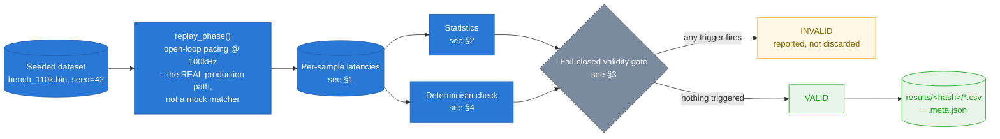
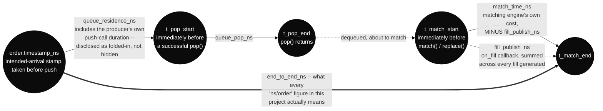
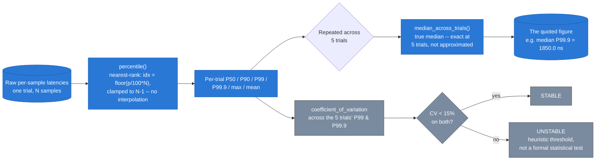
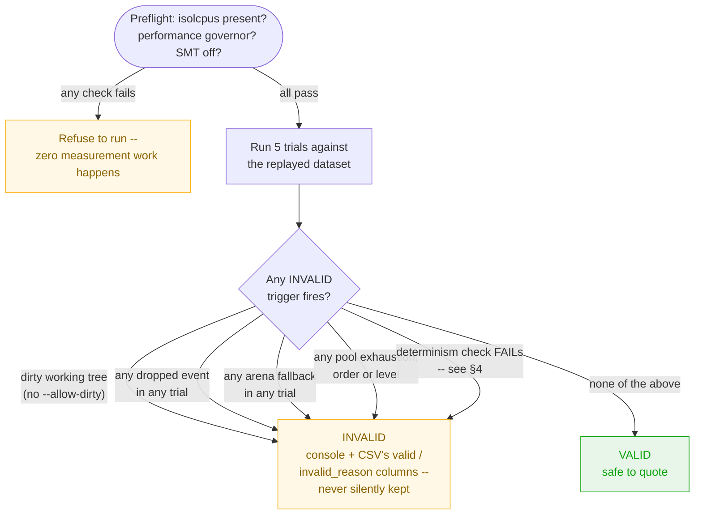
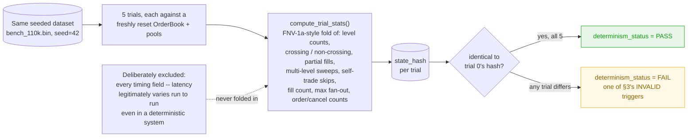
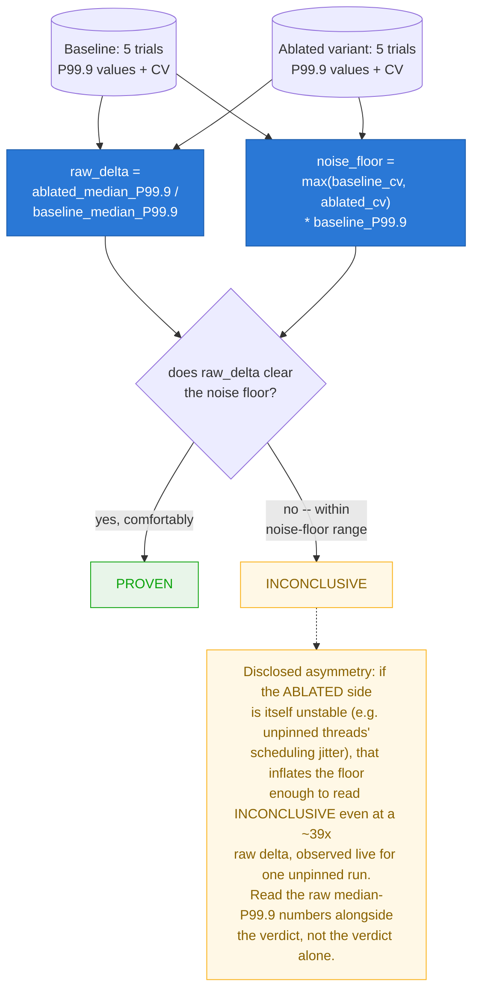

# Measurement Methodology

Six diagrams answering one question: **how does a number in this project
earn the right to be quoted?** Every latency figure in `README.md` traces
back to a precise timestamp boundary, a specific statistical transform,
and two independent pass/fail gates — this document is that trace, made
visual. Nothing here is aspirational: every diagram is a direct
translation of `src/benchmark.cpp`, `include/hydra/stats.hpp`, and
`scripts/run_ablations.sh`'s actual behavior.

**Scope note:** this is the *measurement* layer specifically — for what
the system is built of, see [`ARCHITECTURE.md`](ARCHITECTURE.md); for why
each design decision was made, see [`DESIGN.md`](DESIGN.md); for the
numbers themselves, see [`README.md`](README.md). The governing rule,
carried over unchanged from this project's own methodology notes: **if a
claim made anywhere else — README, a resume, a conversation — can't be
traced to a definition in this document, don't make the claim.**

---

## Contents

0. [The measurement pipeline, end to end](#0-the-measurement-pipeline-end-to-end)
1. [Measurement boundary timeline](#1-measurement-boundary-timeline)
2. [Statistical pipeline](#2-statistical-pipeline)
3. [Fail-closed validity gate](#3-fail-closed-validity-gate)
4. [Determinism check](#4-determinism-check)
5. [Ablation verdict classification](#5-ablation-verdict-classification)

---

## 0. The measurement pipeline, end to end

**What this shows:** the full path from a seeded dataset to a number
that's actually safe to cite, with each stage pointing at the diagram
below that explains it in detail. **What it proves:** `replay_phase()`
drives `matching_thread_fn` — the identical production code path the live
pipeline uses, popping from the real `SpscQueue`, calling the real
`Matcher::match()`/`replace()`, mutating the real `OrderBook`. Benchmark
mode is not a simplified stand-in for production matching; it's
production matching with a paced producer and a recorder attached. Every
sample that comes out of that replay has to survive *two independent*
checks — a resource-safety gate (§3) and a logical-determinism gate (§4)
— before it's allowed to become a quoted figure.

---

## 1. Measurement boundary timeline

**What this shows:** the five named timestamps the harness actually takes
per order, and which of the seven CSV latency columns spans which gap
between them — the dense boundary table in the methodology notes, turned
into something you can trace with your eyes instead of cross-referencing
row by row.

**What it proves:** `end_to_end_ns` (the figure behind every headline
number in this project) is not a single measurement — it's the sum of
every interval below it, including one deliberately disclosed
imperfection: `queue_residence_ns` folds in the producer's own push-call
duration, because the consumer's only available producer-side timestamp
(`order.timestamp_ns`) is stamped *before* the push attempt, not after.
There's no way to retroactively embed "how long my own enqueue took" into
a value that enqueue just finished copying — so rather than approximate
it silently, that seam is measured separately (a trial-level mean/max,
surfaced in `--verbose` output) and named explicitly here instead of
smoothed over. `match_time_ns` is also drawn with a visible fork: it
explicitly *excludes* `fill_publish_ns`, which is tracked as its own
column precisely so a crossing order's fill-callback cost is never
silently absorbed into "the matching engine's own cost."

---

## 2. Statistical pipeline

**What this shows:** the exact transform chain from raw per-sample
nanosecond readings to the single number this project ever quotes —
nearest-rank percentile per trial, then a true median across 5 trials,
with a separate stability check riding alongside it.

**What it proves:** "median P99.9" is doing real statistical work, not
standing in for "a P99.9 from one lucky trial." Nearest-rank percentile
computation is deterministic and reproducible — no interpolation choice
to second-guess — and at exactly 5 trials, `median_across_trials()`
computes a true, exact median (the single middle value), not an
approximation that only gets better with more samples. The
`coefficient_of_variation` branch is what produces the STABLE/UNSTABLE
read printed alongside every result — and it's explicitly labeled a
heuristic (a 15% CV threshold), not dressed up as a rigorous statistical
test it isn't.

---

## 3. Fail-closed validity gate

**What this shows:** two layers of refusal, not one. The preflight gate
stops an untuned host *before any measurement happens at all*; a second,
independent set of five checks can still invalidate a run *after* it
completes, even on a perfectly-tuned host.

**What it proves:** this is the mechanism behind the `0` in this
project's hero-stats band — "0 dropped events across 70 measured trials"
isn't a claim that dropping is impossible, it's a claim that *if* any of
70 trials had dropped an event, exhausted a pool, fallen back to the
heap, or diverged from trial 0's logical outcome, that specific run would
carry `INVALID` in its own CSV rather than being quietly folded into a
median. `--allow-dirty` is the one deliberate escape hatch, and it's
designed to be loud, not silent: a dirty-tree run is still permitted, but
every artifact it produces reports the dirty flag prominently rather than
pretending the tree was clean.

---

## 4. Determinism check

**What this shows:** what actually goes into the `state_hash` this
project prints alongside every result, and — just as importantly — what's
deliberately left out of it.

**What it proves:** determinism here means "identical *logical* outcome,"
not "identical timing." A system whose fill counts, sweep depths, and
self-trade-skip counts are bit-for-bit identical across 5 independent
trials of the same seeded dataset, while its *latencies* naturally vary
run to run, is exactly the behavior a correct deterministic matching
engine should show — and folding timing into the hash would make the
check meaningless, flagging normal scheduling jitter as a correctness
failure. This is the concrete mechanism behind every "state_hash identical
across all trials" line in `CONSOLIDATED_BENCHMARK_RESULTS.md`.

---

## 5. Ablation verdict classification

**What this shows:** the exact arithmetic behind every PROVEN/INCONCLUSIVE
label in `README.md`'s and `ARCHITECTURE.md`'s ablation tables — not a
judgment call made while writing up results, but a formula applied
uniformly to every design decision tested.

**What it proves:** the noise floor is deliberately keyed to *whichever
side is noisier*, baseline or ablated — a reasonable design, but one with
an honestly-documented sharp edge: when the ablated variant is inherently
unstable (unpinned OS-scheduled threads being the textbook case), its own
instability inflates the floor enough to swallow even an enormous raw
delta. That's precisely the mechanism behind core pinning's INCONCLUSIVE
verdict under price-time matching elsewhere in this project — not a
failure of the ablation methodology, but a documented consequence of a
CV-based floor meeting a variant whose whole defect *is* variance. The
project's own stated fix for this — a proper two-sample statistical test
in place of a CV-based floor — is listed as future work, not silently
left unmentioned.

---

## Further reading

- **[`README.md`](README.md)** — the numbers this methodology produces,
  and the reproduction commands that regenerate them.
- **[`ARCHITECTURE.md`](ARCHITECTURE.md)** — the system these
  measurements are taken against: component structure, concurrency model,
  and the AF_XDP path referenced in §0 above.
- **[`DESIGN.md`](DESIGN.md)** — why each measured design decision was
  made, and the full ablation table §5's classification algorithm feeds.
- **`scripts/run_ablations.sh`** — the actual implementation of §5's
  `classify_ablation()` logic, ported directly from
  `hydra::stats::classify_ablation` rather than re-implemented by hand.

All source references above were verified against this project's own
methodology notes and the current working tree; if a referenced function
or file has moved, trust the code over this document and open an issue if
the drift is more than cosmetic.
