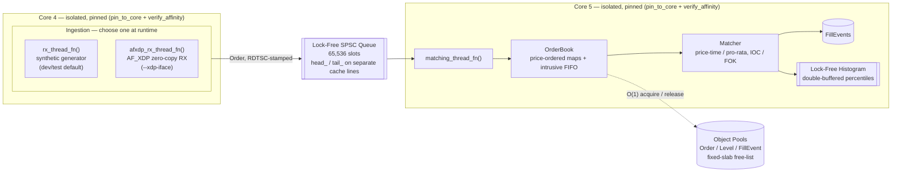
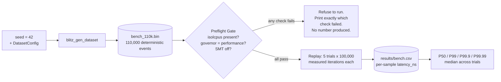

# Blitz Limit Order Book (HYDRA-LOB)

**A lock-free limit order book and matching engine in C++20, engineered as
a measurement problem as much as a matching problem.**

Price-time and pro-rata matching, a lock-free RX → SPSC → matching
pipeline, an AF_XDP/eBPF kernel-bypass ingestion path, and a
preflight-gated benchmark harness that refuses to report a number unless
the host is actually tuned for it — isolated cores, pinned threads, a
calibrated hardware clock, SMT off, verified before a single sample is
measured.

The hard part of a system like this was never the matching logic. It was
making a latency number trustworthy enough to defend line by line — and
then, this session, actually *proving* each design decision earned its
place by temporarily ripping it out, one at a time, and measuring what
broke.

**Language:** C++20 · **Build:** CMake 3.20+ · **Tests:** 15 canonical + 10 phase-gated (ASan/TSan/UBSan) · **Kernel bypass:** AF_XDP/eBPF · **Measured P99.9:** 1205.0 ns

---

## Contents

- [Headline metrics](#headline-metrics)
- [Architecture](#architecture)
- [Results: what each optimization is actually worth](#results-what-each-optimization-is-actually-worth)
- [Environment requirements](#environment-requirements)
- [Build & Run](#build--run)
- [Reproducible Results](#reproducible-results)
- [Things to verify before you trust the numbers](#things-to-verify-before-you-trust-the-numbers)
- [Project structure](#project-structure)
- [Engineering highlights](#engineering-highlights)
- [AF_XDP: what has and hasn't been measured](#af_xdp-what-has-and-hasnt-been-measured)
- [Further reading](#further-reading)
- [License](#license) · [Contact](#contact)

---

## Headline metrics

**Measured: 1205.0 ns median P99.9 end-to-end matching latency** (price-time
mode), dataset seed `42`, 5 trials × 85,118 measured samples/trial, on a
single-socket 12th-gen Intel host with cores 4/5 isolated
(`isolcpus`/`nohz_full`/`rcu_nocbs`), governor pinned to `performance`, SMT
disabled, NUMA-bound via `numactl`. Measured 2026-07-15 against the current
working tree (see the commit-pinning note below).

| Percentile | Median (5 trials) | Spread across trials (max−min) |
|---|---|---|
| P99 | 819.0 ns | — |
| **P99.9** | **1205.0 ns** | **201.0 ns** |
| P99.99 | ~5.7 µs | — |

> **What this number is, precisely:** queue-transit + match-time for the
> in-process matching path, replaying a deterministic, generated dataset
> (`blitz_gen_dataset --seed 42 --count 110000`). It does **not** include
> real network wire time or a live market-data feed under production load.
> AF_XDP ingestion has been verified correct end-to-end but is not the
> source of this number — see [AF_XDP](#af_xdp-what-has-and-hasnt-been-measured).
>
> **Commit pinning note (flagged, unresolved):** this number was measured
> against an uncommitted working tree. `git rev-parse --short HEAD` at the
> time of writing is `d976b20`, but that commit predates this measurement's
> code. Commit the current tree before treating a specific hash as
> authoritative for this number.

---

## Architecture

Every order takes the same path regardless of where it came from: one
lock-free handoff from ingestion to matching, both endpoints pinned to
their own isolated core, nothing on that path ever calling into a general
allocator or a lock.



The trusted latency number above comes from a separate, deterministic path
around that same matching core — a dataset replayed at a fixed rate, gated
by a preflight check that refuses to run on an unverified host:



`Order` itself is laid out deliberately, not just declared — every byte
offset below is enforced by `static_assert` in `types.hpp` and
cross-checked at build time against the live struct via
`metrics/src/struct_layout.cpp`'s `sizeof`/`alignof`/`offsetof`
(`metrics/out/c1_struct_layout.txt` is the current, regenerable proof):

```
Order — 128 bytes, 2 cache lines

CACHE LINE 0 — hot (bytes 0–63): touched on every match-path access
   0– 7   order_id        uint64_t      8B
   8–15   price           int64_t       8B
  16–19   qty             uint32_t      4B
  20      side            Side          1B
  21      tif             TimeInForce   1B
  22–47   hot_padding     uint8_t[26]  26B   (reserved so prev_/next_ land here)
  48–55   prev_           Order*        8B
  56–63   next_           Order*        8B
                                             ── 64-byte cache-line boundary ──
CACHE LINE 1 — cold (bytes 64–127): audit/reporting only, never touched by Matcher
  64–71   timestamp_ns    uint64_t      8B
  72–79   client_id       uint64_t      8B
  80–111  client_tag      char[32]     32B
 112–127  cold_padding    uint8_t[16]  16B
```

Everything the matcher touches per order (`order_id` through `next_`) fits
in the first line; everything that exists only for audit/reporting sits in
the second, so a hot-path cache miss never has to pull in bytes the
matcher doesn't need.

**Component reference:**

- **Pipeline** (`include/hydra/pipeline.hpp`, `src/pipeline.cpp`): two
  pinned threads sharing one `PipelineContext`, connected by the SPSC ring
  above. `rx_thread_fn` is a synthetic order generator — unthrottled by
  design, useful for exercising the matching path, **not** a load
  simulator (see [Things to verify](#things-to-verify-before-you-trust-the-numbers)).
  `afxdp_rx_thread_fn` is the real-traffic alternative, gated behind
  `ENABLE_AFXDP`.
- **`SpscQueue<T, Capacity>`** (`include/hydra/spsc_queue.hpp`):
  fixed-capacity, power-of-2-sized lock-free ring buffer
  (`SPSC_CAPACITY = 65536`), tested for correct ordering under
  ThreadSanitizer.
- **`ObjectPool<T, N>`** (`include/hydra/object_pool.hpp`): fixed-size
  pools for `Order`/`Level`/`FillEvent` — `acquire()`/`release()` are
  O(1) pointer swaps through an intrusive free-list, no allocation on the
  hot path, exhaustion is a recoverable `nullptr`, not a crash.
- **`Order`/`Level`/`FillEvent`** (`include/hydra/types.hpp`): `Order` is
  `alignas(64)`, exactly 128 bytes (two cache lines), explicitly split
  into a hot line (`order_id`, `price`, `qty`, `side`, `tif`, intrusive
  `prev_`/`next_` FIFO pointers) and a cold line (`timestamp_ns`,
  `client_id`, `client_tag`) — enforced by `static_assert`, not just
  documented.
- **`Matcher`** (`include/hydra/matcher.hpp`): price-time and pro-rata
  matching, IOC/FOK time-in-force, against `OrderBook`'s per-level
  intrusive FIFO (`include/hydra/order_book.hpp`) — O(1) cancel via
  direct pointer unlink and a `std::pmr::unordered_map` index, independent
  of FIFO depth.
- **`HdrHistogram`** (`include/hydra/histogram.hpp`): lock-free,
  double-buffered latency histogram — `record()` is wait-free and safe to
  call from the hot path concurrently with a control thread's
  `swap_buffers()` + `query_percentile()`.
- **Hardware clock** (`include/hydra/clock.hpp`): `RDTSCP`-based
  timestamping with `lfence` serialization, one-time calibration against
  `steady_clock`, and automatic fallback to a `steady_clock`-based shim if
  calibration detects cross-core migration or disagreement between two
  independent estimates.
- **AF_XDP** (`include/hydra/xdp/xdp_socket.hpp`, `zero_copy_parser.hpp`,
  `net/xdp_prog.bpf.c`): an AF_XDP socket (UMEM + FILL/COMPLETION/RX/TX
  rings) bound to one `{interface, queue}` pair, fed by an eBPF program
  that redirects UDP order-entry traffic into it via an `xsks_map`; a
  zero-copy parser reads `Order` fields directly out of the UMEM frame
  (no `memcpy`). Compiled in only when `-DENABLE_AFXDP=ON`.

---

## Results: what each optimization is actually worth

Every non-trivial performance decision in this codebase was put to the same
test: temporarily rip it out, replace it with the textbook "obvious"
alternative, rebuild, replay the identical dataset, measure, then revert.
No permanent branches, no invented numbers — full methodology and file/line
references in **[`docs/DESIGN.md`](docs/DESIGN.md)**.

| Design decision | Current (median P99.9) | Rejected alternative | P99.9 delta | Spread delta |
|---|---|---|---|---|
| Lock-free SPSC queue | **1205.0 ns** | `std::mutex` + `std::queue`: 13049.0 ns | **~10.8x worse** | ~24.6x worse |
| Core pinning + isolation | **1205.0 ns** | Unpinned OS-scheduled threads: 18532.0 ns | **~15.4x worse** | ~258x worse |
| Fixed-slab object pooling | **1205.0 ns** | `new`/`delete` per order: 5409.0 ns | **~4.5x worse** | ~48x worse |
| Cache-line hot/cold split | **1205.0 ns** | Flat, unseparated `Order` layout: 3773.0 ns | **~3.1x worse** | ~10.4x worse |

```
P99.9 tail latency — current design vs. rejected alternative (ns, lower is better)
each # ≈ 250 ns

SPSC queue
  lock-free (current)        ##### 1205
  mutex + std::queue         #################################################### 13049

Core pinning
  pinned (current)           ##### 1205
  unpinned                   ########################################################################## 18532

Object pooling
  pool (current)             ##### 1205
  new/delete                 ###################### 5409

Cache-line layout
  hot/cold split (current)   ##### 1205
  flat layout                ############### 3773
```

The spread column is arguably the more interesting one: an unpinned
thread's tail latency is dominated by *when* the scheduler happens to
migrate or preempt it, which is why that ablation shows the largest
variance blowup (258x) even though it isn't the largest median blowup.
Cache-line layout shows the smallest effect of the four, which is
plausible — it's a subtler mechanism than lock contention or allocator
overhead, not a smaller *real* effect necessarily, and that ablation
bundles "removing the split" with "reducing total struct size" (128→88
bytes); see `docs/DESIGN.md` for the full caveat.

One optimization — the AF_XDP kernel-bypass RX path — has no equivalent
ablation yet, because `--benchmark` has no AF_XDP integration to ablate
against. See [AF_XDP](#af_xdp-what-has-and-hasnt-been-measured).

---

## Environment requirements

*(Mirrored from `include/hydra/config.hpp`'s `ENVIRONMENT_REQUIREMENTS`
block, lines 6-37, and the `RX_CORE_ID`/`MATCHING_CORE_ID` note immediately
below it. This section must never drift from that file — if you change one,
change both.)*

1. **GRUB kernel parameters** (`/etc/default/grub`, then
   `sudo update-grub && sudo reboot`):
   ```
   isolcpus=4,5 nohz_full=4,5 rcu_nocbs=4,5
   ```
   Removes the isolated cores from the scheduler pool, suppresses the
   periodic timer tick on them, and offloads RCU callbacks off them.

   > **The core numbers are host-specific, not universal.** This repo's
   > `RX_CORE_ID`/`MATCHING_CORE_ID` are hardcoded to `4`/`5` because, on
   > the 12th-gen Intel hybrid CPU this was developed on, cores 2/3 are the
   > two SMT threads of the *same* physical P-core — disabling SMT on that
   > pair takes core 3 offline entirely rather than freeing it, which
   > permanently fails the SMT-off preflight check below. Cores 4+ (E-cores
   > on that chip) have no SMT sibling. **Before reusing these constants on
   > different hardware**, check:
   > ```
   > cat /sys/devices/system/cpu/cpu*/topology/thread_siblings_list
   > ```
   > and pick two cores that are each their own sole sibling.

2. **CPU frequency governor** (live, no reboot):
   ```
   sudo cpupower frequency-set --governor performance
   ```
   On-demand/powersave governors introduce P-state transitions mid-run,
   adding hundreds of ns of jitter.

3. **SMT / Hyper-Threading must be off**:
   ```
   echo off | sudo tee /sys/devices/system/cpu/smt/control
   ```
   An SMT sibling sharing L1i/decoders/execution ports with the hot-path
   thread adds unpredictable latency spikes.

4. **NUMA**: bind the process to a single node:
   ```
   numactl --cpunodebind=0 --membind=0 ./build/blitz_lob --benchmark ...
   ```
   Cross-node memory access costs ~2-3x local-node latency on multi-socket
   hosts; even one stray remote access can inflate tail latency badly.

The benchmark binary enforces (1), (2), and (3) itself at startup
(`run_preflight_checks()` in `src/benchmark.cpp`) — it refuses to measure
and prints exactly which check failed, rather than silently reporting a
number from an untuned host.

---

## Build & Run

Real target names, confirmed from `CMakeLists.txt` — this project's binary
prefix is `blitz_`, not `hydra_` (the internal C++ namespace is `hydra::`,
which is a separate thing from the build target names).

**Release build:**
```bash
cmake -S . -B build -DCMAKE_BUILD_TYPE=Release
cmake --build build --target blitz_lob -j"$(nproc)"
```

**AF_XDP release build** (needs `libbpf-dev`, `libxdp-dev`, `clang`,
`pkg-config`):
```bash
cmake -S . -B build -DCMAKE_BUILD_TYPE=Release -DENABLE_AFXDP=ON
cmake --build build --target blitz_lob -j"$(nproc)"
make -C net          # builds net/xdp_prog.o (separate clang -target bpf toolchain)
```
This also builds `blitz_send_test_orders`, a manual AF_XDP traffic
generator, only present in this configuration.

**Sanitizer builds** (both are separate targets — ASan and TSan are never
combined in one binary):
```bash
cmake --build build --target blitz_lob_asan -j"$(nproc)"   # ASan + UBSan
cmake --build build --target blitz_lob_tsan -j"$(nproc)"   # TSan + UBSan
```

**Test build + run** — one canonical suite plus ten per-phase exit-condition
binaries, each its own target/executable (phases 3, 6, 9 built with
ASan+UBSan; phase 4 built with TSan+UBSan; the rest plain):
```bash
cmake --build build --target blitz_lob_tests -j"$(nproc)" && ./build/blitz_lob_tests

for t in blitz_lob_test_phase1_types blitz_lob_test_phase2_timing \
         blitz_lob_test_phase3_pool  blitz_lob_test_phase4_spsc \
         blitz_lob_test_phase5_orderbook blitz_lob_test_phase6_matcher \
         blitz_lob_test_phase7_pipeline blitz_lob_test_phase8_benchmark \
         blitz_lob_test_phase9_suite blitz_lob_test_phase10_xdp; do
    cmake --build build --target "$t" -j"$(nproc)" && "./build/$t"
done
```

**Benchmark run** (requires the preflight conditions above; see
[Reproducible Results](#reproducible-results) for the canonical invocation):
```bash
numactl --cpunodebind=0 --membind=0 \
    ./build/blitz_lob --benchmark --mode price_time --core 4 --trials 5 \
    --dataset datasets/bench_110k.bin --output results/bench.csv
```

**AF_XDP run** (needs a bound interface — a real NIC or a veth pair; see
`scripts/setup_veth.sh` for a dev-box test harness using a network
namespace):
```bash
sudo ./build/blitz_lob --xdp-iface veth-hydra0 --xdp-queue 0 \
    --xdp-prog net/xdp_prog.o --xdp-attach-mode skb
```
`--xdp-attach-mode` accepts `native`, `skb`, or `hw`; veth interfaces only
support `skb` (generic) attachment and `XDP_COPY`, never true zero-copy —
see [AF_XDP](#af_xdp-what-has-and-hasnt-been-measured).

---

## Reproducible Results

The canonical, comparable path is a **pinned dataset**, not live
generation — fixed seed, fixed event sequence, deterministic:

```bash
cmake --build build --target blitz_gen_dataset -j"$(nproc)"
./build/blitz_gen_dataset --seed 42 --count 110000 --mid-price 100000 \
    --spread 500 --min-qty 1 --max-qty 1000 --cancel-ratio 0.15 \
    --ioc-ratio 0.05 --fok-ratio 0.02 --rate-hz 100000 \
    --output datasets/bench_110k.bin

numactl --cpunodebind=0 --membind=0 \
    ./build/blitz_lob --benchmark --mode price_time --core 4 --trials 5 \
    --dataset datasets/bench_110k.bin --output results/bench.csv
```

The console prints median P99 only; P99.9/P99.99 require reading
`results/bench.csv` (columns: `version,trial,iteration,latency_ns,
queue_transit_ns,match_time_ns,timestamp_unix`) and computing the
percentile yourself, e.g.:

```python
import csv, statistics
trials = {}
with open("results/bench.csv") as f:
    for row in csv.DictReader(l for l in f if not l.startswith('#')):
        trials.setdefault(int(row["trial"]), []).append(int(row["latency_ns"]))
def pct(vals, p):
    s = sorted(vals); return s[min(int(p/100.0*len(s)), len(s)-1)]
p999s = [pct(v, 99.9) for v in trials.values()]
print("median P99.9:", statistics.median(p999s))
```

**Quick look, no setup** — same command, omit `--dataset`, and it
live-generates an equivalent dataset in-process using the same
`DEFAULT_*` config from `config.hpp`:
```bash
numactl --cpunodebind=0 --membind=0 \
    ./build/blitz_lob --benchmark --mode price_time --core 4 --trials 5 \
    --output results/quicklook.csv
```
**This is not the reproducible/comparable number.** It's useful for a fast
sanity check that the pipeline works end-to-end; only the pinned-dataset
run above should be quoted or compared across machines/commits.

The project also ships a full visual report generator,
`metrics/generate_metrics.sh` → `metrics/out/report.html`, covering
correctness-derived proofs, quick pipeline measurements (explicitly
caveat-banner'd, not the trusted number), a cache-line layout diagram, and
this same gated benchmark plus `perf stat` hardware counters. See
`metrics/README.md` for what each category measures and why.

Reproducing the ablation table above — exact patch/build/measure/revert
steps for all four optimizations — is documented in
**[`docs/DESIGN.md`](docs/DESIGN.md#reproducing-these-numbers)**.

---

## Things to verify before you trust the numbers

Pulled directly from the environment requirements above — the benchmark
checks (1)-(3) itself and refuses to run if they fail, but verify all four
yourself if a number looks off:

- [ ] `cat /sys/devices/system/cpu/isolated` shows your isolated cores
- [ ] `cat /sys/devices/system/cpu/cpuN/cpufreq/scaling_governor` reads
      `performance` for each isolated core `N`
- [ ] `cat /sys/devices/system/cpu/smt/control` reads `off`
- [ ] the process is actually bound to one NUMA node (`numactl --hardware`
      to confirm the node layout; wrap the run in `numactl --cpunodebind=0
      --membind=0` or the equivalent node for your topology)
- [ ] `RX_CORE_ID`/`MATCHING_CORE_ID` in `config.hpp` are two cores that are
      each their own sole entry in `thread_siblings_list` on *your*
      machine — don't assume `4`/`5` is right for different hardware
- [ ] nothing else CPU-heavy is running. On a shared desktop/laptop,
      Turbo Boost's power/thermal budget is shared across the whole
      package — heavy load on *non-isolated* cores can still measurably
      inflate both the median and the trial-to-trial variance of the
      isolated cores' results, even though isolation prevents anything
      from being scheduled directly onto them. Verified directly this
      session: the same benchmark went from 1895.0 ns/7382.0 ns
      (P99/P99.9) with a browser running to 819.0 ns/1205.0 ns with it
      closed — the isolation was correct the whole time, the browser
      was the confound.

---

## Project structure

```
include/hydra/          Core headers: types, object_pool, spsc_queue,
                         order_book, matcher, histogram, clock, affinity,
                         pipeline, config, dataset_generator, benchmark
include/hydra/xdp/       AF_XDP socket wrapper + zero-copy wire parser
                         (compiled only when ENABLE_AFXDP is ON)
src/                     main.cpp (CLI + entry point), pipeline.cpp
                         (RX/matching thread bodies), benchmark.cpp
                         (preflight-gated harness)
net/                     xdp_prog.bpf.c (eBPF redirect program, own
                         clang -target bpf Makefile), xdp_socket_user.cpp
tests/                   blitz_lob_tests (canonical suite) +
                         test_phase1..10_*.cpp (per-phase exit-condition
                         tests, see CMakeLists.txt for the ASan/TSan split)
tools/                   gen_dataset.cpp, send_test_orders.cpp (AF_XDP
                         manual traffic generator)
scripts/                 setup_veth.sh (AF_XDP dev-box test harness,
                         network-namespace-isolated veth pair)
metrics/                 Standalone visual report generator
                         (generate_metrics.sh, generate_report.py) —
                         not wired into the main CMake build
datasets/                Generated dataset files (gitignored) +
                         manifest.txt (reproducibility record of the
                         flags used to produce each one)
docs/DESIGN.md           Full ablation methodology and rationale behind
                         every optimization in the Results table above
```

---

## Engineering highlights

- **Lock-free/wait-free hot path**: SPSC ring buffer, fixed-size object
  pools, double-buffered histogram — no allocation, no locks, no unbounded
  structures on the per-order path. Measured, not asserted: see
  [Results](#results-what-each-optimization-is-actually-worth).
- **Zero-copy AF_XDP ingestion**: `parse_order_zero_copy()` reads `Order`
  fields directly out of UMEM frame memory, no intermediate copy.
- **Kernel-bypass networking** via AF_XDP + a custom eBPF redirect
  program, verified over a real packet path — 15,000/15,000 packets sent,
  received, and parsed with 0 drops and 0 parse errors.
- **Sanitizer-clean by construction**: ASan and TSan are separate,
  purpose-built targets tied to specific exit conditions (pool exhaustion
  under ASan, SPSC ordering under TSan), not an afterthought.
- **Deterministic benchmarking methodology**: fixed-seed dataset
  generation, hardware-clock calibration with automatic unreliable-TSC
  detection, environment preflight gating that fails loudly instead of
  measuring on an untuned host, median-of-5-trials to suppress single-run
  outliers.
- **Every optimization measured against its rejected alternative**, not
  just argued for — four ablation experiments this session, each
  patch → build → measure → revert, full numbers in
  [Results](#results-what-each-optimization-is-actually-worth) and
  `docs/DESIGN.md`.
- **Ten per-phase correctness targets** mapped to explicit exit conditions
  (see the block comment above the per-phase targets in `CMakeLists.txt`),
  not one monolithic test binary.

---

## AF_XDP: what has and hasn't been measured

Verified this session, on a real packet path: an eBPF program
(`net/xdp_prog.bpf.c`) redirecting UDP order-entry traffic into an AF_XDP
socket, a zero-copy parser turning wire frames into `Order`s, and the
result flowing into the same matching pipeline as any other order —
15,000/15,000 packets sent, received, and parsed correctly, 0 drops, 0
parse errors, at a moderate rate (500/sec) over a veth pair with the peer
end in its own network namespace (`scripts/setup_veth.sh`).

**Not yet true**, and don't imply otherwise:
- veth only supports `XDP_COPY` and generic (`skb`) program attachment —
  this validates ring-plumbing and parsing correctness, **not**
  `XDP_ZEROCOPY` performance. That requires a real NIC/driver pair
  (e.g. Mellanox mlx5, Intel i40e/ice).
- The AF_XDP path has not been used to produce the project's headline
  P99.9 number above — that number is dataset-replay only. Live-traffic
  latency was observed (low-tens-of-microseconds p50 at 500 orders/sec,
  under ~400µs p99.99), but that was a lightly-loaded correctness check,
  not a controlled, repeated-trial benchmark, and it measures a different
  (blended, not end-to-end-only) metric than the headline number.

---

## Further reading

- **[`docs/DESIGN.md`](docs/DESIGN.md)** — the full engineering rationale
  behind every decision in this codebase: the problem each one solves, the
  rejected alternative and why, the measured before/after (or an explicit
  "not yet measured" where no ablation exists), and file/line references
  into the real implementation.
- **`metrics/README.md`** — what `metrics/generate_metrics.sh`'s report
  categories (A: correctness proofs, B: quick pipeline measurements,
  C: struct layout, D: the real benchmark) each measure and why they're
  organized that way.
- **`datasets/manifest.txt`** — the exact `blitz_gen_dataset` flags behind
  every dataset file referenced in this README and in `docs/DESIGN.md`.

---

## License

No `LICENSE` file exists in this repository yet — all rights reserved by
default until one is added. Add a `LICENSE` file before treating this as
open source in any legal sense.

## Contact

Add your preferred contact method here (email, LinkedIn, GitHub handle) —
none was found in the repository to pull from automatically.
