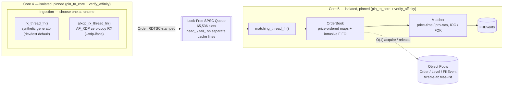
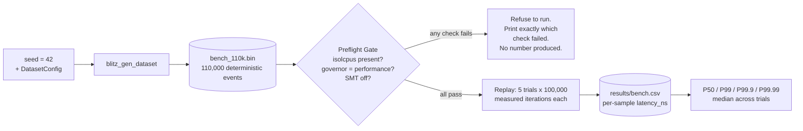

# Blitz Limit Order Book (HYDRA-LOB)

**A lock-free limit order book and matching engine in C++20, engineered as
a measurement problem as much as a matching problem.**

Price-time and pro-rata matching, a lock-free RX → SPSC → matching
pipeline, an AF_XDP/eBPF kernel-bypass ingestion path, and a
preflight-gated benchmark harness that refuses to report a number unless
the host is actually tuned for it — isolated cores, pinned threads, a
calibrated hardware clock, SMT off, verified before a single sample is
measured.

The hard part of a system like this was never the matching logic. It was
making a latency number trustworthy enough to defend line by line — and
then, this session, actually *proving* each design decision earned its
place by temporarily ripping it out, one at a time, and measuring what
broke.

**Language:** C++20 · **Build:** CMake 3.20+ · **Tests:** 10 per-phase exit-condition suites (ASan/TSan/UBSan) · **Kernel bypass:** AF_XDP/eBPF · **Measured P99.9:** 1205.0 ns

---

## Contents

- [Headline metrics](#headline-metrics)
- [Architecture](#architecture)
- [Results: what each optimization is actually worth](#results-what-each-optimization-is-actually-worth)
- [Environment requirements](#environment-requirements)
- [Build & Run](#build--run)
- [Reproducible Results](#reproducible-results)
- [Ablation suite](#ablation-suite)
- [Things to verify before you trust the numbers](#things-to-verify-before-you-trust-the-numbers)
- [Project structure](#project-structure)
- [Engineering highlights](#engineering-highlights)
- [AF_XDP: what has and hasn't been measured](#af_xdp-what-has-and-hasnt-been-measured)
- [Further reading](#further-reading)
- [License](#license) · [Contact](#contact)

---

## Headline metrics

**Measured: 1205.0 ns median P99.9 end-to-end matching latency** (price-time
mode), dataset seed `42`, 5 trials × 85,118 measured samples/trial, on a
single-socket 12th-gen Intel host with cores 4/5 isolated
(`isolcpus`/`nohz_full`/`rcu_nocbs`), governor pinned to `performance`, SMT
disabled, NUMA-bound via `numactl`. Measured 2026-07-15 against the current
working tree (see the commit-pinning note below).

| Percentile | Median (5 trials) | Spread across trials (max−min) |
|---|---|---|
| P99 | 819.0 ns | — |
| **P99.9** | **1205.0 ns** | **201.0 ns** |
| P99.99 | ~5.7 µs | — |

> **What this number is, precisely:** queue-transit + match-time for the
> in-process matching path, replaying a deterministic, generated dataset
> (`blitz_gen_dataset --seed 42 --count 110000`). It does **not** include
> real network wire time or a live market-data feed under production load.
> AF_XDP ingestion has been verified correct end-to-end but is not the
> source of this number — see [AF_XDP](#af_xdp-what-has-and-hasnt-been-measured).
>
> **Commit pinning note (flagged, unresolved):** this number was measured
> against an uncommitted working tree. `git rev-parse --short HEAD` at the
> time of writing is `d976b20`, but that commit predates this measurement's
> code. Commit the current tree before treating a specific hash as
> authoritative for this number.

---

## Architecture

Every order takes the same path regardless of where it came from: one
lock-free handoff from ingestion to matching, both endpoints pinned to
their own isolated core, nothing on that path ever calling into a general
allocator or a lock.



The trusted latency number above comes from a separate, deterministic path
around that same matching core — a dataset replayed at a fixed rate, gated
by a preflight check that refuses to run on an unverified host:



`Order` itself is laid out deliberately, not just declared — every byte
offset below is enforced directly by `static_assert` in `types.hpp`
(`sizeof(Order) == 128`, `alignof(Order) == 64`, and the rest) — the
actual proof mechanism, not an illustration of one:

```
Order — 128 bytes, 2 cache lines

CACHE LINE 0 — hot (bytes 0–63): touched on every match-path access
   0– 7   order_id        uint64_t      8B
   8–15   price           int64_t       8B
  16–19   qty             uint32_t      4B
  20      side            Side          1B
  21      tif             TimeInForce   1B
  22–47   hot_padding     uint8_t[26]  26B   (reserved so prev_/next_ land here)
  48–55   prev_           Order*        8B
  56–63   next_           Order*        8B
                                             ── 64-byte cache-line boundary ──
CACHE LINE 1 — cold (bytes 64–127): audit/reporting only, never touched by Matcher
  64–71   timestamp_ns    uint64_t      8B
  72–79   client_id       uint64_t      8B
  80–111  client_tag      char[32]     32B
 112–127  cold_padding    uint8_t[16]  16B
```

Everything the matcher touches per order (`order_id` through `next_`) fits
in the first line; everything that exists only for audit/reporting sits in
the second, so a hot-path cache miss never has to pull in bytes the
matcher doesn't need.

**Component reference:**

- **Pipeline** (`include/hydra/pipeline.hpp`, `src/pipeline.cpp`): two
  pinned threads sharing one `PipelineContext`, connected by the SPSC ring
  above. `rx_thread_fn` is a synthetic order generator — unthrottled by
  design, useful for exercising the matching path, **not** a load
  simulator (see [Things to verify](#things-to-verify-before-you-trust-the-numbers)).
  `afxdp_rx_thread_fn` is the real-traffic alternative, gated behind
  `ENABLE_AFXDP`.
- **`SpscQueue<T, Capacity>`** (`include/hydra/spsc_queue.hpp`):
  fixed-capacity, power-of-2-sized lock-free ring buffer
  (`SPSC_CAPACITY = 65536`), tested for correct ordering under
  ThreadSanitizer.
- **`ObjectPool<T, N>`** (`include/hydra/object_pool.hpp`): fixed-size
  pools for `Order`/`Level`/`FillEvent` — `acquire()`/`release()` are
  O(1) pointer swaps through an intrusive free-list, no allocation on the
  hot path, exhaustion is a recoverable `nullptr`, not a crash.
- **`Order`/`Level`/`FillEvent`** (`include/hydra/types.hpp`): `Order` is
  `alignas(64)`, exactly 128 bytes (two cache lines), explicitly split
  into a hot line (`order_id`, `price`, `qty`, `side`, `tif`, intrusive
  `prev_`/`next_` FIFO pointers) and a cold line (`timestamp_ns`,
  `client_id`, `client_tag`) — enforced by `static_assert`, not just
  documented.
- **`Matcher`** (`include/hydra/matcher.hpp`): price-time and pro-rata
  matching, IOC/FOK time-in-force, against `OrderBook`'s per-level
  intrusive FIFO (`include/hydra/order_book.hpp`) — O(1) cancel via
  direct pointer unlink and a `std::pmr::unordered_map` index, independent
  of FIFO depth.
- **Latency capture** (`RawSampleSink`, `include/hydra/pipeline.hpp`): a
  plain pre-sized buffer the matching thread writes each order's
  queue-transit/match-time/end-to-end sample into. This project used to
  also carry a lock-free double-buffered `HdrHistogram` alongside it —
  removed, because the one code path that produces this project's actual
  latency numbers (`--benchmark`) never read it; it recorded every order's
  latency on the hot path for a live-mode console readout nobody should
  have quoted as a result. One capture mechanism, one number.
- **Hardware clock** (`include/hydra/clock.hpp`): `RDTSCP`-based
  timestamping with `lfence` serialization, one-time calibration against
  `steady_clock`, and automatic fallback to a `steady_clock`-based shim if
  calibration detects cross-core migration or disagreement between two
  independent estimates.
- **AF_XDP** (`include/hydra/xdp/xdp_socket.hpp`, `zero_copy_parser.hpp`,
  `net/xdp_prog.bpf.c`): an AF_XDP socket (UMEM + FILL/COMPLETION/RX/TX
  rings) bound to one `{interface, queue}` pair, fed by an eBPF program
  that redirects UDP order-entry traffic into it via an `xsks_map`; a
  zero-copy parser reads `Order` fields directly out of the UMEM frame
  (no `memcpy`). Compiled in only when `-DENABLE_AFXDP=ON`.

---

## Results: what each optimization is actually worth

Every non-trivial performance decision in this codebase was put to the same
test: temporarily rip it out, replace it with the textbook "obvious"
alternative, rebuild, replay the identical dataset, measure, then revert.
No permanent branches, no invented numbers — full methodology and file/line
references in **[`docs/DESIGN.md`](docs/DESIGN.md)**.

| Design decision | Current (median P99.9) | Rejected alternative | P99.9 delta | Spread delta |
|---|---|---|---|---|
| Lock-free SPSC queue | **1205.0 ns** | `std::mutex` + `std::queue`: 13049.0 ns | **~10.8x worse** | ~24.6x worse |
| Core pinning + isolation | **1205.0 ns** | Unpinned OS-scheduled threads: 18532.0 ns | **~15.4x worse** | ~258x worse |
| Fixed-slab object pooling | **1205.0 ns** | `new`/`delete` per order: 5409.0 ns | **~4.5x worse** | ~48x worse |
| Cache-line hot/cold split | **1205.0 ns** | Flat, unseparated `Order` layout: 3773.0 ns | **~3.1x worse** | ~10.4x worse |

```
P99.9 tail latency — current design vs. rejected alternative (ns, lower is better)
each # ≈ 250 ns

SPSC queue
  lock-free (current)        ##### 1205
  mutex + std::queue         #################################################### 13049

Core pinning
  pinned (current)           ##### 1205
  unpinned                   ########################################################################## 18532

Object pooling
  pool (current)             ##### 1205
  new/delete                 ###################### 5409

Cache-line layout
  hot/cold split (current)   ##### 1205
  flat layout                ############### 3773
```

The spread column is arguably the more interesting one: an unpinned
thread's tail latency is dominated by *when* the scheduler happens to
migrate or preempt it, which is why that ablation shows the largest
variance blowup (258x) even though it isn't the largest median blowup.
Cache-line layout shows the smallest effect of the four, which is
plausible — it's a subtler mechanism than lock contention or allocator
overhead, not a smaller *real* effect necessarily, and that ablation
bundles "removing the split" with "reducing total struct size" (128→88
bytes); see `docs/DESIGN.md` for the full caveat.

One optimization — the AF_XDP kernel-bypass RX path — has no equivalent
ablation yet, because `--benchmark` has no AF_XDP integration to ablate
against. See [AF_XDP](#af_xdp-what-has-and-hasnt-been-measured).

---

## Environment requirements

*(Mirrored from `include/hydra/config.hpp`'s `ENVIRONMENT_REQUIREMENTS`
block, lines 6-37, and the `RX_CORE_ID`/`MATCHING_CORE_ID` note immediately
below it. This section must never drift from that file — if you change one,
change both.)*

1. **GRUB kernel parameters** (`/etc/default/grub`, then
   `sudo update-grub && sudo reboot`):
   ```
   isolcpus=4,5 nohz_full=4,5 rcu_nocbs=4,5
   ```
   Removes the isolated cores from the scheduler pool, suppresses the
   periodic timer tick on them, and offloads RCU callbacks off them.

   > **The core numbers are host-specific, not universal.** This repo's
   > `RX_CORE_ID`/`MATCHING_CORE_ID` are hardcoded to `4`/`5` because, on
   > the 12th-gen Intel hybrid CPU this was developed on, cores 2/3 are the
   > two SMT threads of the *same* physical P-core — disabling SMT on that
   > pair takes core 3 offline entirely rather than freeing it, which
   > permanently fails the SMT-off preflight check below. Cores 4+ (E-cores
   > on that chip) have no SMT sibling. **Before reusing these constants on
   > different hardware**, check:
   > ```
   > cat /sys/devices/system/cpu/cpu*/topology/thread_siblings_list
   > ```
   > and pick two cores that are each their own sole sibling.

2. **CPU frequency governor** (live, no reboot):
   ```
   sudo cpupower frequency-set --governor performance
   ```
   On-demand/powersave governors introduce P-state transitions mid-run,
   adding hundreds of ns of jitter.

3. **SMT / Hyper-Threading must be off**:
   ```
   echo off | sudo tee /sys/devices/system/cpu/smt/control
   ```
   An SMT sibling sharing L1i/decoders/execution ports with the hot-path
   thread adds unpredictable latency spikes.

4. **NUMA**: bind the process to a single node:
   ```
   numactl --cpunodebind=0 --membind=0 ./build/blitz_lob --benchmark ...
   ```
   Cross-node memory access costs ~2-3x local-node latency on multi-socket
   hosts; even one stray remote access can inflate tail latency badly.

The benchmark binary enforces (1), (2), and (3) itself at startup
(`run_preflight_checks()` in `src/benchmark.cpp`) — it refuses to measure
and prints exactly which check failed, rather than silently reporting a
number from an untuned host.

---

## Build & Run

Real target names, confirmed from `CMakeLists.txt` — this project's binary
prefix is `blitz_`, not `hydra_` (the internal C++ namespace is `hydra::`,
which is a separate thing from the build target names).

**Release build:**
```bash
cmake -S . -B build -DCMAKE_BUILD_TYPE=Release
cmake --build build --target blitz_lob -j"$(nproc)"
```

**AF_XDP release build** (needs `libbpf-dev`, `libxdp-dev`, `clang`,
`pkg-config`):
```bash
cmake -S . -B build -DCMAKE_BUILD_TYPE=Release -DENABLE_AFXDP=ON
cmake --build build --target blitz_lob -j"$(nproc)"
make -C net          # builds net/xdp_prog.o (separate clang -target bpf toolchain)
```
This also builds `blitz_send_test_orders`, a manual AF_XDP traffic
generator, only present in this configuration.

**Sanitizer builds** (both are separate targets — ASan and TSan are never
combined in one binary):
```bash
cmake --build build --target blitz_lob_asan -j"$(nproc)"   # ASan + UBSan
cmake --build build --target blitz_lob_tsan -j"$(nproc)"   # TSan + UBSan
```

**Test build + run** — ten per-phase exit-condition binaries (phases 3, 6, 9
built with ASan+UBSan; phase 4 built with TSan+UBSan; the rest plain), all
wired into `ctest` — one command runs all 10:
```bash
cmake --build build -j"$(nproc)"
ctest --test-dir build --output-on-failure
```
Per-phase granularity is still available when you only want one, e.g.
`ctest --test-dir build -R phase6_matcher`.

**Benchmark run** (requires the preflight conditions above; see
[Reproducible Results](#reproducible-results) for the canonical invocation).
There is exactly one command that produces a latency number in this
project — `--benchmark` with `--dataset` — always pinned to `RX_CORE_ID`/
`MATCHING_CORE_ID` internally, never a caller-chosen core:
```bash
numactl --cpunodebind=0 --membind=0 \
    ./build/blitz_lob --benchmark --mode price_time --trials 5 \
    --dataset datasets/bench_110k.bin \
    --output "results/$(git rev-parse --short HEAD)/bench.csv"
```

**AF_XDP run** (needs a bound interface — a real NIC or a veth pair; see
`scripts/setup_veth.sh` for a dev-box test harness using a network
namespace):
```bash
sudo ./build/blitz_lob --xdp-iface veth-hydra0 --xdp-queue 0 \
    --xdp-prog net/xdp_prog.o --xdp-attach-mode skb
```
`--xdp-attach-mode` accepts `native`, `skb`, or `hw`; veth interfaces only
support `skb` (generic) attachment and `XDP_COPY`, never true zero-copy —
see [AF_XDP](#af_xdp-what-has-and-hasnt-been-measured).

---

## Reproducible Results

There is exactly one path to a latency number in this project — a
**pinned dataset** replayed through `--benchmark` — fixed seed, fixed event
sequence, deterministic. There is no live-generation fallback and no
"quick look" alternative: those used to exist as a second invocation shape
of the same flag, which meant `--benchmark` could quietly report two
different numbers depending on whether `--dataset` was remembered. Removed
so `--benchmark --dataset ...` is the only way to get a number, full stop.

```bash
cmake --build build --target blitz_gen_dataset -j"$(nproc)"
./build/blitz_gen_dataset --seed 42 --count 110000 --mid-price 100000 \
    --spread 500 --min-qty 1 --max-qty 1000 --cancel-ratio 0.15 \
    --ioc-ratio 0.05 --fok-ratio 0.02 --rate-hz 100000 \
    --output datasets/bench_110k.bin

numactl --cpunodebind=0 --membind=0 \
    ./build/blitz_lob --benchmark --mode price_time --trials 5 \
    --dataset datasets/bench_110k.bin \
    --output "results/$(git rev-parse --short HEAD)/bench.csv"
```

The command refuses to run (before any measurement work) if the build was
made from a dirty working tree, if `--dataset` is missing, or if
`RX_CORE_ID`/`MATCHING_CORE_ID` aren't isolated/governed/SMT-off — see
[Environment requirements](#environment-requirements). Its stdout summary
and the CSV's leading comment lines both carry the dataset seed, the full
environment snapshot (isolated cores, governors, SMT sibling lists, git
hash, dirty flag), the measured order-sample count actually used for the
order-latency percentile (lower than the raw measured-iteration count,
since cancels are counted and reported separately, not folded into it —
see the console's own `median P99 (end-to-end, cancels)` lines), and a
count of any order-book arena fallback allocations, plus order/level pool
exhaustion counts (each should always be 0 — nonzero means either the
"no heap allocation after init" guarantee or a pool's fixed capacity
didn't hold for that run). A run with `--trials` below the
canonical 5 is stamped `SMOKETEST` in both places and should not be quoted.

The console prints median P99 only; P99.9/P99.99 require reading the CSV
(columns: `version,trial,iteration,latency_ns,
queue_transit_ns,match_time_ns,timestamp_unix,is_cancel`) and computing the
percentile yourself, e.g.:

```python
import csv, statistics
trials = {}
with open("results/<hash>/bench.csv") as f:
    for row in csv.DictReader(l for l in f if not l.startswith('#')):
        if row["is_cancel"] == "1":
            continue  # order latency and cancel latency are separate figures -- see below
        trials.setdefault(int(row["trial"]), []).append(int(row["latency_ns"]))
def pct(vals, p):
    s = sorted(vals); return s[min(int(p/100.0*len(s)), len(s)-1)]
p999s = [pct(v, 99.9) for v in trials.values()]
print("median P99.9 (orders):", statistics.median(p999s))
```

Cancel latency is a separate figure, not folded into the order P99/P99.9
above: filter for `row["is_cancel"] == "1"` instead, group by trial the
same way, and take the median across trials -- the console's own
`median P99 (end-to-end, cancels)`/`median P99.9 (end-to-end, cancels)`
lines report exactly this.

Reproducing the ablation table above — exact patch/build/measure/revert
steps for all four optimizations — is documented in
**[`docs/DESIGN.md`](docs/DESIGN.md#reproducing-these-numbers)**, and is
now also automated:

## Ablation suite

```bash
cmake --build build --target \
    blitz_lob_ablation_mutex_queue blitz_lob_ablation_unpinned \
    blitz_lob_ablation_malloc_pool blitz_lob_ablation_flat_layout \
    blitz_gen_dataset_ablation_flat_layout -j"$(nproc)"
./scripts/run_ablations.sh --trials 5
```

Builds and runs the baseline plus four ablation targets
(`blitz_lob_ablation_mutex_queue`, `_unpinned`, `_malloc_pool`,
`_flat_layout` — see `ablation/` and `CMakeLists.txt`'s "Automated
ablation suite" section for how each shadows exactly one real header via
include-path ordering, never mutating `src/`/`include/`), each through the
same real, gated `--benchmark` path, producing
`results/<hash>/ablation_summary.{csv,md}` in the same shape as the table
above. Expect the same *direction* as that table (every ablation slower
than baseline), not necessarily the same multiplier — different
machine/session/load.

This project deliberately stops at two benchmarks — the latency number
above and this ablation suite. Together they're a complete story ("here's
how fast it is" + "here's proof it's fast for the reasons claimed");
anything more (rate sweeps, depth sweeps, mode comparisons, five-nines
tails, soak tests) adds explanation surface without adding a claim
distinct enough to be worth it.

---

## Things to verify before you trust the numbers

Pulled directly from the environment requirements above — the benchmark
checks (1)-(3) itself and refuses to run if they fail, but verify all four
yourself if a number looks off:

- [ ] `cat /sys/devices/system/cpu/isolated` shows your isolated cores
- [ ] `cat /sys/devices/system/cpu/cpuN/cpufreq/scaling_governor` reads
      `performance` for each isolated core `N`
- [ ] `cat /sys/devices/system/cpu/smt/control` reads `off`
- [ ] the process is actually bound to one NUMA node (`numactl --hardware`
      to confirm the node layout; wrap the run in `numactl --cpunodebind=0
      --membind=0` or the equivalent node for your topology)
- [ ] `RX_CORE_ID`/`MATCHING_CORE_ID` in `config.hpp` are two cores that are
      each their own sole entry in `thread_siblings_list` on *your*
      machine — don't assume `4`/`5` is right for different hardware
- [ ] nothing else CPU-heavy is running. On a shared desktop/laptop,
      Turbo Boost's power/thermal budget is shared across the whole
      package — heavy load on *non-isolated* cores can still measurably
      inflate both the median and the trial-to-trial variance of the
      isolated cores' results, even though isolation prevents anything
      from being scheduled directly onto them. Verified directly this
      session: the same benchmark went from 1895.0 ns/7382.0 ns
      (P99/P99.9) with a browser running to 819.0 ns/1205.0 ns with it
      closed — the isolation was correct the whole time, the browser
      was the confound.

---

## Project structure

```
include/hydra/          Core headers: types, object_pool, spsc_queue,
                         order_book, matcher, clock, affinity, pipeline,
                         config, dataset_generator, benchmark
include/hydra/xdp/       AF_XDP socket wrapper + zero-copy wire parser
                         (compiled only when ENABLE_AFXDP is ON)
src/                     main.cpp (CLI + entry point), pipeline.cpp
                         (RX/matching thread bodies), benchmark.cpp
                         (preflight-gated harness)
ablation/                Rejected-alternative headers for the automated
                         ablation suite (mutex_queue, unpinned,
                         malloc_pool, flat_layout) -- each shadows exactly
                         one real header via include-path ordering, never
                         touches src/ or the real include/. See
                         scripts/run_ablations.sh.
net/                     xdp_prog.bpf.c (eBPF redirect program, own
                         clang -target bpf Makefile), xdp_socket_user.cpp
tests/                   test_phase1..10_*.cpp (per-phase exit-condition
                         tests, see CMakeLists.txt for the ASan/TSan split)
tools/                   gen_dataset.cpp, send_test_orders.cpp (AF_XDP
                         manual traffic generator)
scripts/                 run_ablations.sh (the ablation suite, see
                         above), setup_veth.sh (AF_XDP dev-box test
                         harness, network-namespace-isolated veth pair)
datasets/                Generated dataset files (gitignored) +
                         manifest.txt (reproducibility record of the
                         flags used to produce each one)
docs/DESIGN.md           Full ablation methodology and rationale behind
                         every optimization in the Results table above
```

---

## Engineering highlights

- **Lock-free/wait-free hot path**: SPSC ring buffer, fixed-size object
  pools, double-buffered histogram — no allocation, no locks, no unbounded
  structures on the per-order path. Measured, not asserted: see
  [Results](#results-what-each-optimization-is-actually-worth).
- **Zero-copy AF_XDP ingestion**: `parse_order_zero_copy()` reads `Order`
  fields directly out of UMEM frame memory, no intermediate copy.
- **Kernel-bypass networking** via AF_XDP + a custom eBPF redirect
  program, verified over a real packet path — 15,000/15,000 packets sent,
  received, and parsed with 0 drops and 0 parse errors.
- **Sanitizer-clean by construction**: ASan and TSan are separate,
  purpose-built targets tied to specific exit conditions (pool exhaustion
  under ASan, SPSC ordering under TSan), not an afterthought.
- **Deterministic benchmarking methodology**: fixed-seed dataset
  generation, hardware-clock calibration with automatic unreliable-TSC
  detection, environment preflight gating that fails loudly instead of
  measuring on an untuned host, median-of-5-trials to suppress single-run
  outliers.
- **Every optimization measured against its rejected alternative**, not
  just argued for — four ablation experiments this session, each
  patch → build → measure → revert, full numbers in
  [Results](#results-what-each-optimization-is-actually-worth) and
  `docs/DESIGN.md`.
- **Ten per-phase correctness targets** mapped to explicit exit conditions
  (see the block comment above the per-phase targets in `CMakeLists.txt`),
  not one monolithic test binary.

---

## AF_XDP: what has and hasn't been measured

### Verified working

An eBPF program (`net/xdp_prog.bpf.c`) redirecting UDP order-entry traffic
into an AF_XDP socket, a zero-copy parser turning wire frames into
`Order`s, and the result flowing into the same matching pipeline as any
other order — confirmed correct over a veth pair with the peer end in its
own network namespace (`scripts/setup_veth.sh`), twice: 15,000/15,000
packets at 500/sec, then 20,000/20,000 at 1000/sec, both 0 drops and 0
parse errors.

**Not yet true**, and don't imply otherwise:
- veth only supports `XDP_COPY` and generic (`skb`) program attachment —
  this validates ring-plumbing and parsing correctness, **not**
  `XDP_ZEROCOPY` performance. That requires a real NIC/driver pair
  (e.g. Mellanox mlx5, Intel i40e/ice).
- The AF_XDP path has not been used to produce the project's headline
  P99.9 number above — that number is dataset-replay only, and stays
  that way (see the live-latency investigation below for exactly what
  the AF_XDP path's own numbers mean and don't mean).

### Bugs found and fixed by a critical audit of the AF_XDP path

Prompted by an unexplained live-latency reading (see below), the AF_XDP
code was audited line by line — twice, independently (a direct read plus
a separate agent pass) — for correctness bugs, not just the performance
question that started it. Four real bugs came out of it, all fixed and
covered by the existing test suite (`blitz_lob_test_phase10_xdp`, now 8
tests, all passing; full suite of 79+ tests across every phase passing
with zero regressions):

- **No UDP port filter in the eBPF classifier** (`net/xdp_prog.bpf.c`).
  It redirected *any* IPv4/UDP packet on the bound queue — DNS, mDNS, any
  other service sharing that queue — into the AF_XDP socket, and
  `parse_order_zero_copy()` has no checksum/magic/version validation of
  its own, so a stray ≥30-byte UDP payload could become a syntactically
  valid `Order` with arbitrary field values. Fixed: the eBPF program now
  checks the UDP destination port against `AFXDP_ORDER_ENTRY_UDP_PORT`
  (40000) and rejects (`XDP_PASS`) anything else, with a new
  `HYDRA_STAT_WRONG_PORT` counter to make the rejection visible.
- **IP fragments weren't rejected** — same underlying gap (no payload
  validation) via a different packet shape; a fragment has
  `ip->protocol == IPPROTO_UDP` but no real UDP header at that offset.
  Fixed alongside the port filter, with a `HYDRA_STAT_FRAGMENTED` counter.
- **`XdpSocket::release_frame()`'s double-release guard was sized against
  the wrong capacity and failed silently** (`net/xdp_socket_user.cpp`).
  It guarded against overflowing the compile-time array size (4096), not
  this instance's actual seeded frame count — and a caught double-release
  was just dropped, no counter, no signal. Fixed: guards against the
  correct per-instance count and increments a new
  `double_release_count()`, now printed in `afxdp_rx_thread_fn`'s
  periodic/final report lines alongside `received`/`parsed_ok`/
  `parse_errors`/`dropped`.
- **VLAN-tagged frames were misclassified.** The eBPF classifier already
  handled 802.1Q/802.1AD tags correctly when deciding what to redirect,
  but `parse_order_zero_copy()` (`zero_copy_parser.hpp`) assumed a bare
  Ethernet header and rejected anything VLAN-tagged as a parse error even
  though the kernel had routed it there correctly. Fixed: the parser now
  unwraps a single VLAN tag before reading the inner EtherType (a
  double-tagged/QinQ frame is still deliberately rejected — this parser
  is bounded to one tag by design). Covered by two new tests:
  `test_parse_accepts_single_vlan_tag`, `test_parse_rejects_double_vlan_tag`.

None of these four turned out to be the cause of the live-latency question
that prompted the audit — that mystery had a completely different,
non-AF_XDP-specific answer, below. They're real, independently valuable
fixes found along the way.

### The live-latency investigation: what actually explained the numbers

A live AF_XDP run initially reported P99.9 latency in the 1.6–2.3μs
range, then — after other environmental factors were controlled for — a
run that looked far worse, with `queue_transit_ns` (RX-thread-to-matching-
thread handoff) sitting at **p50=684,260ns, p99.9=3,035,560ns**, while
`match_time_ns` (the matching engine's own per-order cost) stayed healthy
at **p50=291ns, p99.9=4,693ns**. That decomposed split — obtained by
temporarily wiring the same `RawSampleSink` mechanism `--benchmark`
already uses into the live pipeline (`src/main.cpp`, marked `DIAG-TEMP`
and since removed once the investigation below resolved) — was the key
piece of evidence: whatever was wrong was in the *queue handoff*, not the
matching engine, and not (per the earlier ablation study) the lock-free
`SpscQueue` itself.

The actual cause, confirmed with hard evidence rather than a guess:
**a separate benchmark process was left running in the background, pinned
to the same isolated cores (4 and 5) the live AF_XDP test also uses.**
`isolcpus` stops the scheduler from putting *unrelated* processes on those
cores by default — it does nothing to stop two processes that both
explicitly request the same isolated cores from fighting the OS scheduler
for them. Three independent pieces of evidence converged on this:

1. `sudo bpftool map dump name xdp_prog_stats` during the run showed
   `REDIRECTED` summed across all CPUs at **exactly 20,000** — matching
   the packets actually sent, with `WRONG_PORT`/`FRAGMENTED` both zero —
   ruling out extraneous network traffic as a contributor.
2. The decomposed split above pointed at the queue handoff specifically.
3. A same-condition `--benchmark` control run showed the same signature
   *while contaminated* (variance across trials: **3,000,176ns** — almost
   exactly matching the contaminated run's `queue_transit_ns` p99.9) and
   a **completely different, healthy result once run in isolation**:
   median P99 **1467.0ns**, variance **20,743ns** (compare to the
   contaminated run's P99 22,815ns, variance 3,000,176ns).

With nothing else on cores 4/5, the live AF_XDP path's own numbers came
back genuinely healthy: **`queue_transit_ns` p50=204ns, `match_time_ns`
p50=230ns, `end_to_end_ns` p50=470ns** (n=19,906 samples) — squarely in
line with expectations, confirming the AF_XDP path, the SPSC queue, and
the matching engine are all working correctly. **Never run `--benchmark`
and a live AF_XDP test at the same time, or on the same isolated cores as
anything else** — this is now the top item to check if a live number ever
looks wrong again.

**One residual, smaller finding**: even with no contending process, the
tail (`queue_transit_ns` p99=22,459ns, p99.9=26,203ns) stayed elevated
while `match_time_ns`'s own tail stayed tight (p99=1,253ns, p99.9=2,227ns).
Traced to real hardware interrupts landing on the isolated cores —
`isolcpus`/`nohz_full` isolate *scheduling*, not *interrupt routing*,
which is a separate kernel mechanism entirely. `/proc/interrupts` showed
the touchpad's IRQ (14 and 133, same physical device via two paths) firing
144,743 times during one test window, landing directly on core 4 — almost
certainly because the trackpad was being actively used (e.g. to scroll
terminal output) while the test ran. IRQ 14 was successfully moved off
cores 4/5; IRQ 133 rejected the same change (`Operation not permitted`) —
it's routed through an `intel-gpio` controller, which frequently doesn't
support CPU-affinity changes at the hardware/driver level at all, not a
permissions problem. **The simplest actual fix: don't touch the trackpad
while a test is running.** This residual is a general-purpose-laptop-
kernel characteristic, not a code defect — eliminating it fully would need
kernel-level real-time tuning (e.g. `PREEMPT_RT`), out of scope for this
project's code.

### Commands to reproduce this investigation

```bash
# Confirm the eBPF layer is redirecting exactly what you sent, nothing more
sudo bpftool map dump name xdp_prog_stats
# key 0 = REDIRECTED, 1 = PASSED, 2 = NOT_UDP, 3 = WRONG_PORT, 4 = FRAGMENTED
# sum REDIRECTED across all "cpu" entries and compare to packets actually sent

# Before trusting any live AF_XDP number, confirm nothing else is on cores 4/5
ps -eo pid,psr,pcpu,comm | grep blitz_lob

# Move a movable IRQ off the isolated cores (IO-APIC-routed IRQs only --
# GPIO-routed ones, like a touchpad's second IRQ line, will often reject this)
echo 0-3,6-11 | sudo tee /proc/irq/<N>/smp_affinity_list
cat /proc/irq/<N>/effective_affinity_list   # confirms whether it actually took
```

The live pipeline's `DIAG decomposed` output (separate `queue_transit_ns`/
`match_time_ns`/`end_to_end_ns` percentiles, printed once at shutdown
alongside the histogram report that existed at the time) was temporary
instrumentation added to `src/main.cpp` for this investigation, marked
`DIAG-TEMP`. It has since been removed, along with the histogram report
itself (see "Latency capture" under [Architecture](#architecture)) — both
were cleanup candidates once the investigation resolved, and both are now
gone rather than just flagged for removal.

---

## Further reading

- **[`docs/DESIGN.md`](docs/DESIGN.md)** — the full engineering rationale
  behind every decision in this codebase: the problem each one solves, the
  rejected alternative and why, the measured before/after (or an explicit
  "not yet measured" where no ablation exists), and file/line references
  into the real implementation.
- **`datasets/manifest.txt`** — the exact `blitz_gen_dataset` flags behind
  every dataset file referenced in this README and in `docs/DESIGN.md`.

---

## License

MIT — see [`LICENSE`](LICENSE).

## Contact

Add your preferred contact method here (email, LinkedIn, GitHub handle) —
none was found in the repository to pull from automatically.
